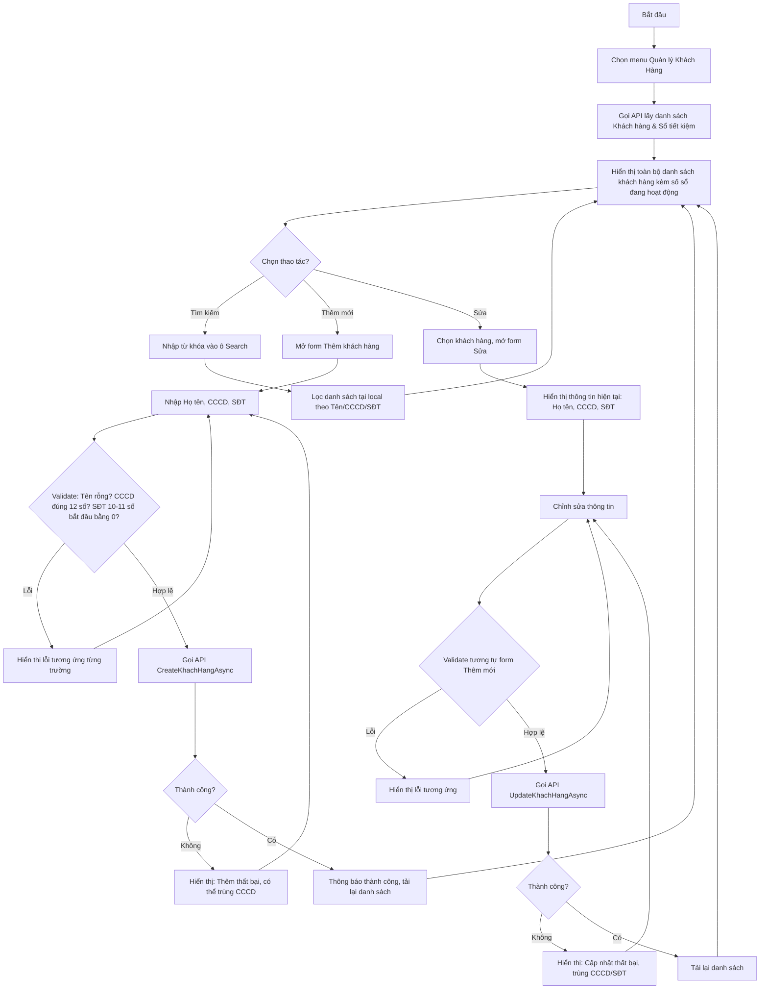

# User Flow: Quản lý Khách hàng

Sơ đồ dạng Flowchart mô tả quy trình Quản lý thông tin khách hàng (Thêm, Sửa, Tra cứu).

```mermaid
flowchart TD
    A["Bắt đầu"] --> B["Chọn menu Quản lý Khách Hàng"]
    B --> C["Gọi API lấy danh sách Khách hàng & Sổ tiết kiệm"]
    C --> D["Hiển thị toàn bộ danh sách khách hàng kèm số sổ đang hoạt động"]
    D --> E{"Chọn thao tác?"}

    E -- Tìm kiếm --> F["Nhập từ khóa vào ô Search"]
    F --> G["Lọc danh sách tại local theo Tên/CCCD/SĐT"]
    G --> D

    E -- Thêm mới --> H["Mở form Thêm khách hàng"]
    H --> I["Nhập Họ tên, CCCD, SĐT"]
    I --> J{"Validate: Tên rỗng? CCCD đúng 12 số? SĐT 10-11 số bắt đầu bằng 0?"}
    J -- Lỗi --> K["Hiển thị lỗi tương ứng từng trường"]
    K --> I
    J -- Hợp lệ --> L["Gọi API CreateKhachHangAsync"]
    L --> M{"Thành công?"}
    M -- Không --> N["Hiển thị: Thêm thất bại, có thể trùng CCCD"]
    N --> I
    M -- Có --> O["Thông báo thành công, tải lại danh sách"]
    O --> D

    E -- Sửa --> P["Chọn khách hàng, mở form Sửa"]
    P --> Q["Hiển thị thông tin hiện tại: Họ tên, CCCD, SĐT"]
    Q --> R["Chỉnh sửa thông tin"]
    R --> S{"Validate tương tự form Thêm mới"}
    S -- Lỗi --> T["Hiển thị lỗi tương ứng"]
    T --> R
    S -- Hợp lệ --> U["Gọi API UpdateKhachHangAsync"]
    U --> V{"Thành công?"}
    V -- Không --> W["Hiển thị: Cập nhật thất bại, trùng CCCD/SĐT"]
    W --> R
    V -- Có --> X["Tải lại danh sách"]
    X --> D
```
