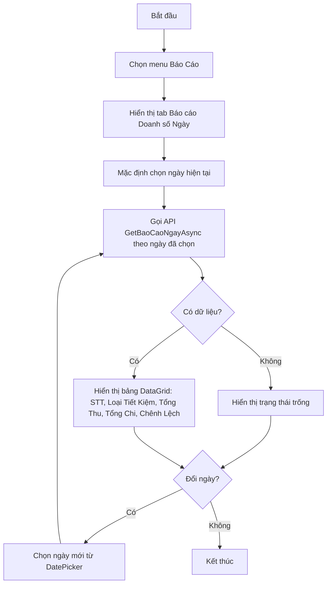

# User Flow: Báo Cáo Doanh Số Ngày

Sơ đồ dạng Flowchart mô tả quy trình xem Báo cáo doanh số hoạt động theo ngày.

```mermaid
flowchart TD
    A["Bắt đầu"] --> B["Chọn menu Báo Cáo"]
    B --> C["Hiển thị tab Báo cáo Doanh số Ngày"]
    C --> D["Mặc định chọn ngày hiện tại"]
    D --> E["Gọi API GetBaoCaoNgayAsync theo ngày đã chọn"]
    E --> F{"Có dữ liệu?"}
    F -- Không --> G["Hiển thị trạng thái trống"]
    G --> H{"Đổi ngày?"}
    F -- Có --> I["Hiển thị bảng DataGrid: STT, Loại Tiết Kiệm, Tổng Thu, Tổng Chi, Chênh Lệch"]
    I --> H
    H -- Có --> J["Chọn ngày mới từ DatePicker"]
    J --> E
    H -- Không --> K["Kết thúc"]
```
