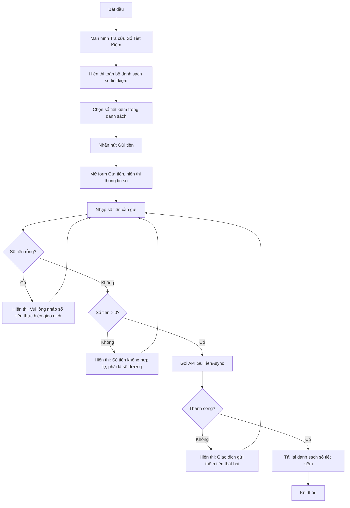

# User Flow: Lập Phiếu Gửi Tiền

Sơ đồ dạng Flowchart mô tả quy trình gửi tiền vào sổ tiết kiệm. Thao tác được thực hiện từ màn hình Tra cứu Sổ Tiết Kiệm: chọn sổ trong danh sách rồi thực hiện gửi tiền.

