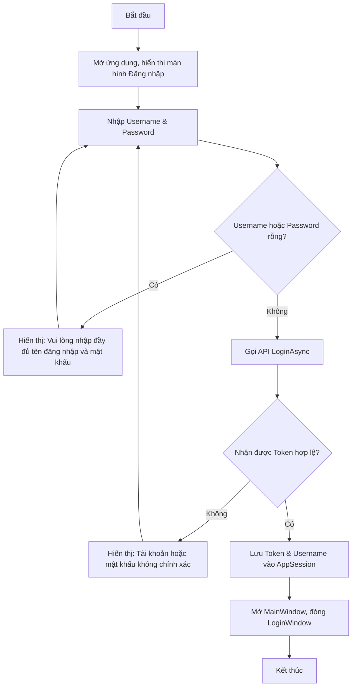

# User Flow: Đăng nhập

Sơ đồ dạng Flowchart mô tả quy trình người dùng đăng nhập vào hệ thống.

```mermaid
flowchart TD
    A["Bắt đầu"] --> B["Mở ứng dụng, hiển thị màn hình Đăng nhập"]
    B --> C["Nhập Username & Password"]
    C --> D{"Username hoặc Password rỗng?"}
    D -- Có --> E["Hiển thị: Vui lòng nhập đầy đủ tên đăng nhập và mật khẩu"]
    E --> C
    D -- Không --> F["Gọi API LoginAsync"]
    F --> G{"Nhận được Token hợp lệ?"}
    G -- Không --> H["Hiển thị: Tài khoản hoặc mật khẩu không chính xác"]
    H --> C
    G -- Có --> I["Lưu Token & Username vào AppSession"]
    I --> J["Mở MainWindow, đóng LoginWindow"]
    J --> K["Kết thúc"]
```
