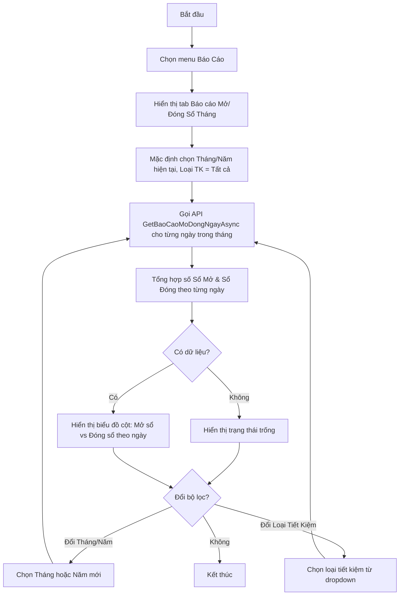

# User Flow: Báo Cáo Mở/Đóng Sổ Tháng

Sơ đồ dạng Flowchart mô tả quy trình xem Báo cáo mở/đóng sổ tiết kiệm trong tháng dưới dạng biểu đồ cột.

```mermaid
flowchart TD
    A["Bắt đầu"] --> B["Chọn menu Báo Cáo"]
    B --> C["Hiển thị tab Báo cáo Mở/Đóng Sổ Tháng"]
    C --> D["Mặc định chọn Tháng/Năm hiện tại, Loại TK = Tất cả"]
    D --> E["Gọi API GetBaoCaoMoDongNgayAsync cho từng ngày trong tháng"]
    E --> F["Tổng hợp số Sổ Mở & Sổ Đóng theo từng ngày"]
    F --> G{"Có dữ liệu?"}
    G -- Không --> H["Hiển thị trạng thái trống"]
    G -- Có --> I["Hiển thị biểu đồ cột: Mở sổ vs Đóng sổ theo ngày"]
    H --> J{"Đổi bộ lọc?"}
    I --> J
    J -- Đổi Tháng/Năm --> K["Chọn Tháng hoặc Năm mới"]
    K --> E
    J -- Đổi Loại Tiết Kiệm --> L["Chọn loại tiết kiệm từ dropdown"]
    L --> E
    J -- Không --> M["Kết thúc"]
```
