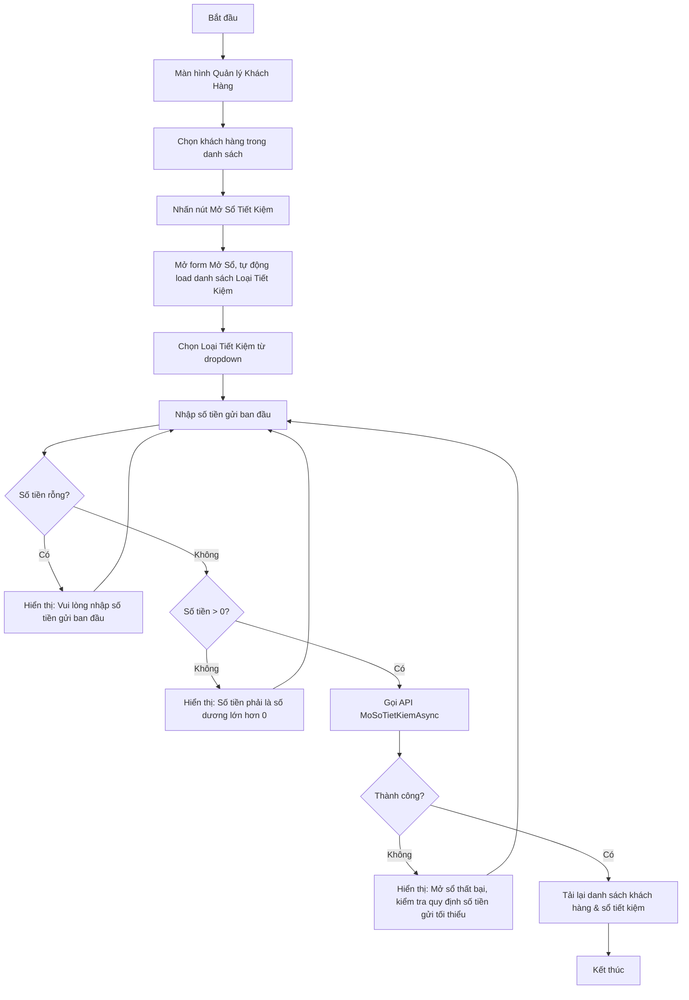

# User Flow: Mở Sổ Tiết Kiệm

Sơ đồ dạng Flowchart mô tả quy trình mở sổ tiết kiệm mới cho khách hàng. Chức năng Mở Sổ nằm trong màn hình Quản lý Khách hàng: chọn khách hàng trước, rồi mở sổ cho khách hàng đó.

