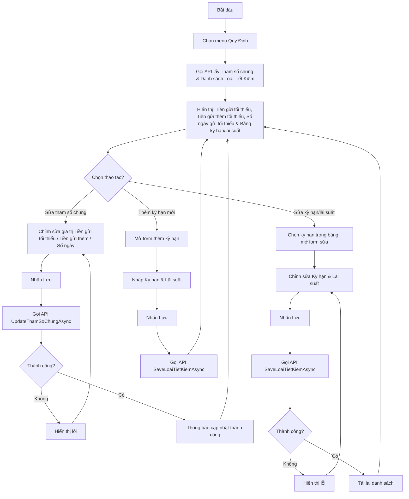

# User Flow: Quản lý Quy Định

Sơ đồ dạng Flowchart mô tả quy trình cập nhật Tham số chung và Loại Tiết Kiệm.

```mermaid
flowchart TD
    A["Bắt đầu"] --> B["Chọn menu Quy Định"]
    B --> C["Gọi API lấy Tham số chung & Danh sách Loại Tiết Kiệm"]
    C --> D["Hiển thị: Tiền gửi tối thiểu, Tiền gửi thêm tối thiểu, Số ngày gửi tối thiểu & Bảng kỳ hạn/lãi suất"]
    D --> E{"Chọn thao tác?"}

    E -- Sửa tham số chung --> F["Chỉnh sửa giá trị Tiền gửi tối thiểu / Tiền gửi thêm / Số ngày"]
    F --> G["Nhấn Lưu"]
    G --> H["Gọi API UpdateThamSoChungAsync"]
    H --> I{"Thành công?"}
    I -- Không --> J["Hiển thị lỗi"]
    J --> F
    I -- Có --> K["Thông báo cập nhật thành công"]
    K --> D

    E -- Sửa kỳ hạn/lãi suất --> L["Chọn kỳ hạn trong bảng, mở form sửa"]
    L --> M["Chỉnh sửa Kỳ hạn & Lãi suất"]
    M --> N["Nhấn Lưu"]
    N --> O["Gọi API SaveLoaiTietKiemAsync"]
    O --> P{"Thành công?"}
    P -- Không --> Q["Hiển thị lỗi"]
    Q --> M
    P -- Có --> R["Tải lại danh sách"]
    R --> D

    E -- Thêm kỳ hạn mới --> S["Mở form thêm kỳ hạn"]
    S --> T["Nhập Kỳ hạn & Lãi suất"]
    T --> U["Nhấn Lưu"]
    U --> V["Gọi API SaveLoaiTietKiemAsync"]
    V --> D
```
