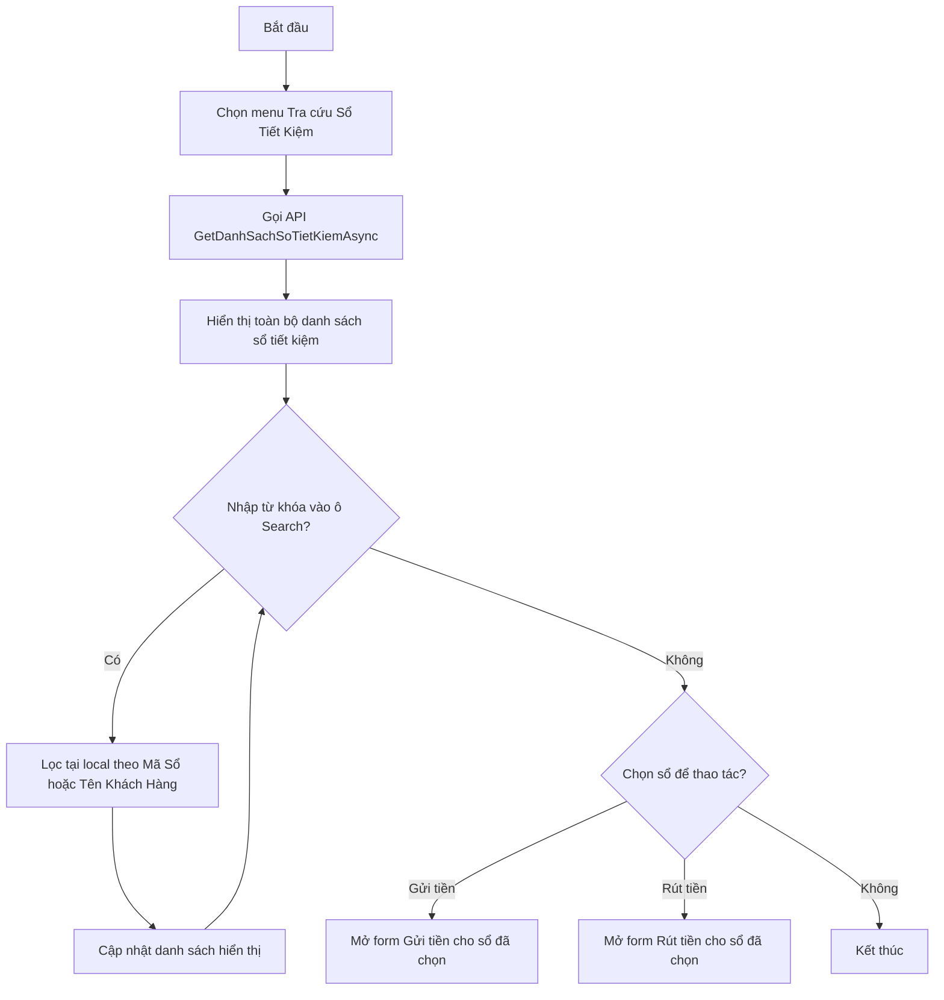

# User Flow: Tra cứu Sổ Tiết Kiệm

Sơ đồ dạng Flowchart mô tả quy trình tra cứu sổ tiết kiệm. Danh sách sổ được hiển thị toàn bộ ngay khi mở, thanh tìm kiếm lọc dữ liệu tại local bằng LINQ.

```mermaid
flowchart TD
    A["Bắt đầu"] --> B["Chọn menu Tra cứu Sổ Tiết Kiệm"]
    B --> C["Gọi API GetDanhSachSoTietKiemAsync"]
    C --> D["Hiển thị toàn bộ danh sách sổ tiết kiệm"]
    D --> E{"Nhập từ khóa vào ô Search?"}
    E -- Có --> F["Lọc tại local theo Mã Sổ hoặc Tên Khách Hàng"]
    F --> G["Cập nhật danh sách hiển thị"]
    G --> E
    E -- Không --> H{"Chọn sổ để thao tác?"}
    H -- Gửi tiền --> I["Mở form Gửi tiền cho sổ đã chọn"]
    H -- Rút tiền --> J["Mở form Rút tiền cho sổ đã chọn"]
    H -- Không --> K["Kết thúc"]
```
