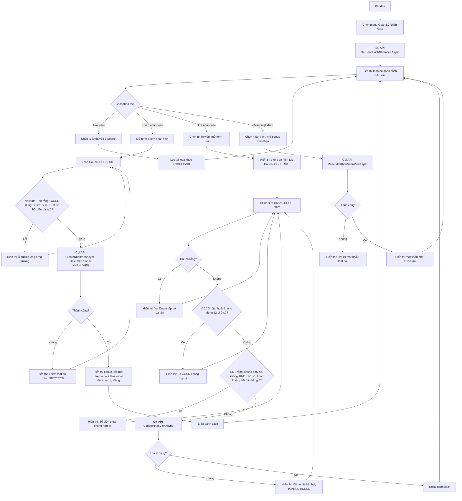

# User Flow: Quản lý Nhân Viên

Sơ đồ dạng Flowchart mô tả quy trình quản lý tài khoản nhân viên (Thêm, Sửa, Reset mật khẩu).

```mermaid
flowchart TD
    A["Bắt đầu"] --> B["Chọn menu Quản Lý Nhân Viên"]
    B --> C["Gọi API GetDanhSachNhanVienAsync"]
    C --> D["Hiển thị toàn bộ danh sách nhân viên"]
    D --> E{"Chọn thao tác?"}

    E -- Tìm kiếm --> F["Nhập từ khóa vào ô Search"]
    F --> G["Lọc tại local theo Tên/CCCD/SĐT"]
    G --> D

    E -- Thêm nhân viên --> H["Mở form Thêm nhân viên"]
    H --> I["Nhập Họ tên, CCCD, SĐT"]
    I --> J{"Validate: Tên rỗng? CCCD đúng 12 số? SĐT 10-11 số bắt đầu bằng 0?"}
    J -- Lỗi --> K["Hiển thị lỗi tương ứng từng trường"]
    K --> I
    J -- Hợp lệ --> L["Gọi API CreateNhanVienAsync, Role mặc định = NHAN_VIEN"]
    L --> M{"Thành công?"}
    M -- Không --> N["Hiển thị: Thêm thất bại, trùng SĐT/CCCD"]
    N --> I
    M -- Có --> O["Hiển thị popup kết quả: Username & Password được tạo tự động"]
    O --> P["Tải lại danh sách"]
    P --> D

    E -- Sửa nhân viên --> Q["Chọn nhân viên, mở form Sửa"]
    Q --> R["Hiển thị thông tin hiện tại: Họ tên, CCCD, SĐT"]
    R --> R1["Chỉnh sửa Họ tên, CCCD, SĐT"]
    R1 --> S{"Họ tên rỗng?"}
    S -- Có --> S1["Hiển thị: Vui lòng nhập họ và tên"]
    S1 --> R1
    S -- Không --> S2{"CCCD rỗng hoặc không đúng 12 chữ số?"}
    S2 -- Có --> S3["Hiển thị: Số CCCD không hợp lệ"]
    S3 --> R1
    S2 -- Không --> S4{"SĐT rỗng, không phải số, không 10-11 chữ số, hoặc không bắt đầu bằng 0?"}
    S4 -- Có --> S5["Hiển thị: Số điện thoại không hợp lệ"]
    S5 --> R1
    S4 -- Không --> U["Gọi API UpdateNhanVienAsync"]
    U --> V{"Thành công?"}
    V -- Không --> W["Hiển thị: Cập nhật thất bại, trùng SĐT/CCCD"]
    W --> R1
    V -- Có --> X["Tải lại danh sách"]
    X --> D

    E -- Reset mật khẩu --> Y["Chọn nhân viên, mở popup xác nhận"]
    Y --> Z["Gọi API ResetMatKhauNhanVienAsync"]
    Z --> AA{"Thành công?"}
    AA -- Không --> AB["Hiển thị: Đặt lại mật khẩu thất bại"]
    AA -- Có --> AC["Hiển thị mật khẩu mới được tạo"]
    AC --> D
```
