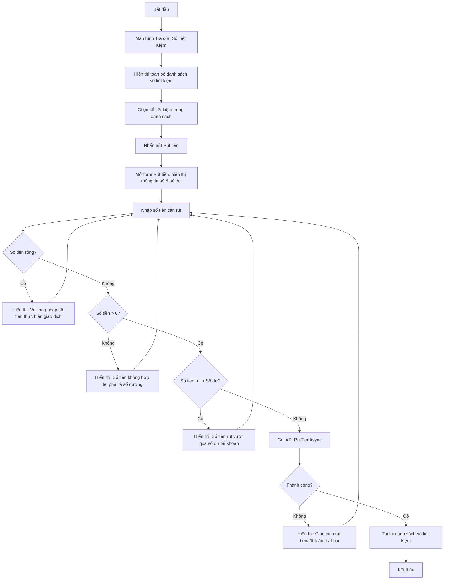

# User Flow: Lập Phiếu Rút Tiền

Sơ đồ dạng Flowchart mô tả quy trình rút tiền từ sổ tiết kiệm. Thao tác được thực hiện từ màn hình Tra cứu Sổ Tiết Kiệm: chọn sổ trong danh sách rồi thực hiện rút tiền.

